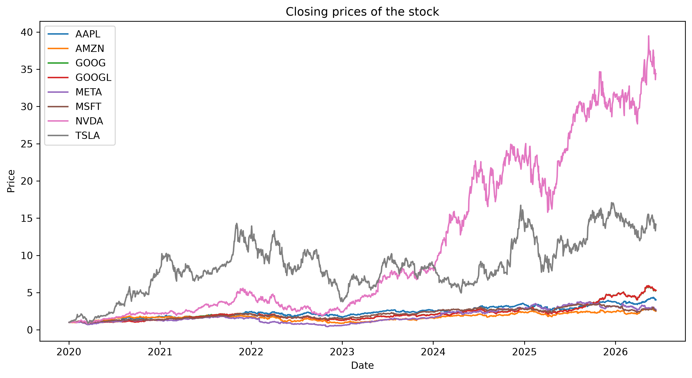
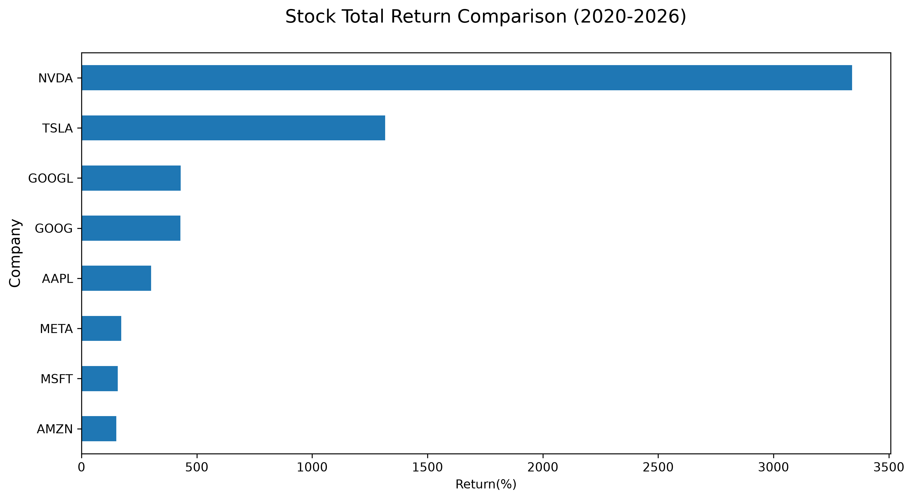
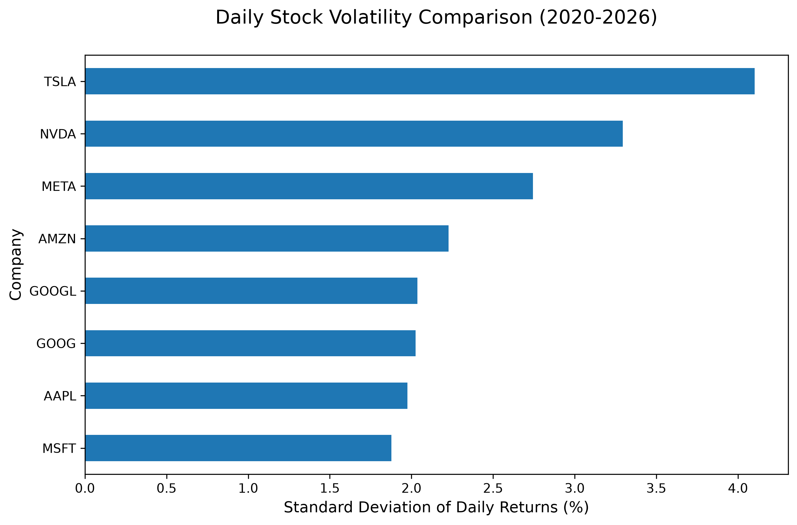
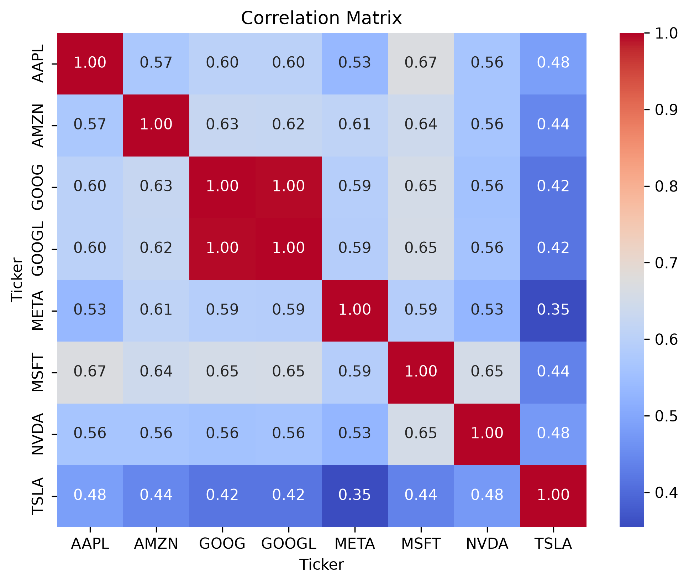
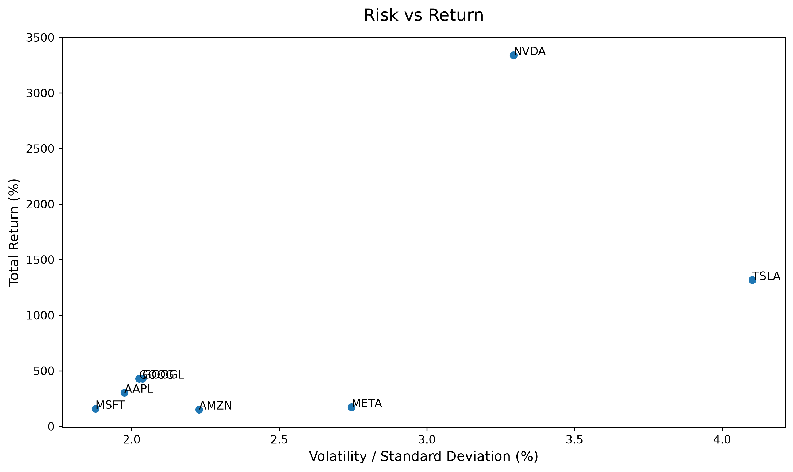

# Financial Data Analysis of Major Technology Companies (2020–2026)

## Table of Contents
- [Overview](#overview)
- [Companies Analyzed](#companies-analyzed)
- [Technologies Used](#technologies-used)
- [Project Workflow](#project-workflow)
- [Key Findings](#key-findings)
- [Installation](#installation)

## Overview

This project analyzes the stock performance of some of the world's largest technology companies between January 2020 and June 2026. Using historical market data obtained through Yahoo Finance, the analysis explores price evolution, total returns, volatility, correlations, and the relationship between risk and return.

The objective is to apply data analysis techniques using Python and gain insights into the behavior of major technology stocks over time.

## Companies Analyzed

* Apple (AAPL)
* Microsoft (MSFT)
* Alphabet Class C (GOOG)
* Alphabet Class A (GOOGL)
* Nvidia (NVDA)
* Amazon (AMZN)
* Meta (META)
* Tesla (TSLA)

---

## Technologies Used

* Python
* Pandas
* NumPy
* Matplotlib
* Seaborn
* yFinance

---

## Project Workflow

### 1. Data Collection

Historical stock data was downloaded using the yFinance library, covering the period from January 2020 to June 2026.

### 2. Price Normalization

Since each stock started at a different price level, prices were normalized to compare their relative growth over time.

<p align="center">
  
</p>

### 3. Total Return Analysis

The total return of each stock was calculated as the percentage change between its initial and final prices.

<p align="center">
  
</p>

### 4. Volatility Analysis

Daily returns were computed and their standard deviation was used as a measure of volatility.

<p align="center">
  
</p>

### 5. Correlation Analysis

A correlation matrix was generated to study how the stock movements were related to one another.

<p align="center">
  
</p>

### 6. Risk vs Return Analysis

A scatter plot was created to compare each company's total return against its volatility.

<p align="center">
  
</p>

This chart compares the total return of each company against its volatility.

---

## Key Findings

### Nvidia's Exceptional Performance

Nvidia achieved the highest total return among all analyzed companies, exceeding 3300% during the analyzed period. Its growth significantly outperformed the rest of the technology sector.

### Tesla's High Volatility

Tesla exhibited the highest volatility, indicating stronger day-to-day price fluctuations than any other company in the analysis.

### Stable Performance of Microsoft and Apple

Microsoft and Apple showed lower volatility levels while maintaining positive long-term growth, reflecting a more stable stock behavior.

### Correlation Between Technology Stocks

Most companies displayed moderate positive correlations, suggesting that they tend to react similarly to broader market and technology-sector trends.

As expected, GOOG and GOOGL presented an almost perfect correlation since both represent share classes of Alphabet.

---

## Results

The project includes:

* Historical stock price visualization
* Normalized stock performance comparison
* Total return comparison
* Volatility comparison
* Correlation matrix and heatmap
* Risk vs Return scatter plot
* Final conclusions and interpretation

---

## Limitations

This analysis is based exclusively on historical stock prices and does not consider dividends, company fundamentals, macroeconomic conditions, or other external factors. Therefore, the results should not be interpreted as investment advice.

---

## Installation

Clone the repository:

```bash
git clone https://github.com/abrahamgonzalez-dev/tech-stocks-analysis.git
```

Install the required dependencies:

```bash
pip install pandas numpy matplotlib seaborn yfinance
```

Run the Jupyter Notebook:

```bash
jupyter notebook
```

## Author

Abraham — Computer Engineering Student interested in Data Science, Artificial Intelligence, and Financial Analytics.


